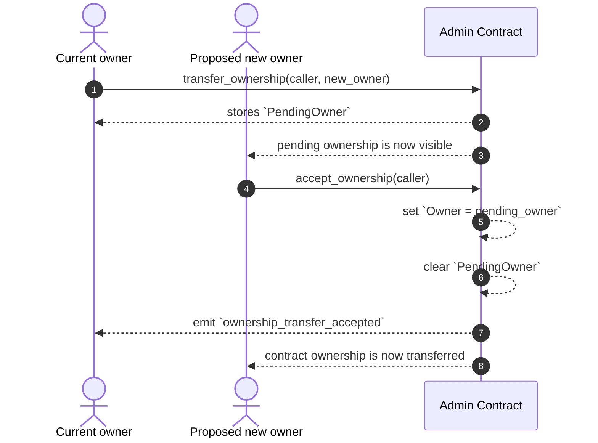

# Two-Step Admin Rotation

This page documents the operator-facing admin rotation pattern used by the admin contract in Credence. The goal is to keep the process explicit, reviewable, and safe when ownership or a privileged admin role needs to move from one address to another.

Audience: operators and contributors who need to rotate admin keys without relying on tribal knowledge.

## What the pattern is

The admin contract uses a two-step ownership transfer:

1. The current owner proposes a new owner.
2. The proposed owner must explicitly accept the transfer.

That means one transaction cannot silently move the contract to a new address. The current owner cannot unilaterally hand over control in a single call, and the new owner must authenticate as the pending recipient before the move is finalized.

In the current implementation, the relevant entrypoints are:

- `transfer_ownership(caller, new_owner)`
- `accept_ownership(caller)`

The contract enforces the following safety checks:

- `caller` must be the current owner
- `new_owner` must be different from the current owner
- `new_owner` must already be a `SuperAdmin`
- `new_owner` must be active and not suspended
- `accept_ownership` may only be called by the address that was set as the pending owner

## Sequence



## Why this shape is safer

The two-step pattern is intentionally conservative:

- It prevents a fat-fingered key rotation from becoming a silent privilege loss.
- It gives the current operator time to notice and react if a proposed replacement key is wrong.
- It ensures the receiving address has to explicitly accept the role.
- It provides a clean audit trail through the emitted ownership-transfer events.

This is important for Soroban contracts because the contract state and authorization model are immutable once deployed, so the admin path must be designed to make accidental misconfiguration difficult.

## Concrete operator example

The following CLI flow is the intended administration workflow for the admin contract.

### 1. Propose the new owner

```bash
soroban contract invoke \
  --id <ADMIN_CONTRACT_ID> \
  --source old_admin \
  --network testnet \
  -- \
  transfer_ownership \
  --caller <OLD_ADMIN> \
  --new_owner <NEW_ADMIN>
```

### 2. Accept the transfer from the proposed owner

```bash
soroban contract invoke \
  --id <ADMIN_CONTRACT_ID> \
  --source new_admin \
  --network testnet \
  -- \
  accept_ownership \
  --caller <NEW_ADMIN>
```

After the second call, the contract updates its owner and clears the pending owner slot.

## Related pattern: bond admin transfer

The bond contract uses a direct dual-auth transfer that requires both the current admin and the new admin to authorize the operation. This is a different pattern from the admin contract's owner rotation:

- The admin contract uses a pending-owner handoff with an explicit second-step acceptance.
- The bond contract uses a dual-auth call where the transfer is accepted in the same operation by the old and new admin pair.

That difference is useful when reviewing the codebase: if you are rotating contract-wide ownership, use the admin contract’s two-step flow. If you are changing the bond’s operational admin, the bond contract’s dual-auth path is the one to inspect.

## Operational checklist

Before you rotate ownership:

1. Confirm the new address is already a `SuperAdmin` in the admin contract.
2. Confirm the receiving address is the correct wallet or multisig account.
3. Confirm the current owner has authenticated the proposal.
4. Confirm the proposed owner is prepared to call `accept_ownership` with the same address used during the proposal.

After the transfer:

1. Query `get_owner` and verify the new owner is set.
2. Query `get_pending_owner` and verify it is `None`.
3. Re-run any downstream checks that depend on the old admin identity.

## Rationale

The pattern exists to separate proposal from acceptance so that a single compromised key or a mistaken invocation cannot silently move governance. In a protocol that relies on admin privileges for sensitive actions, the safest path is not the shortest path; it is the one that makes every step visible, authenticated, and reversible in practice.
