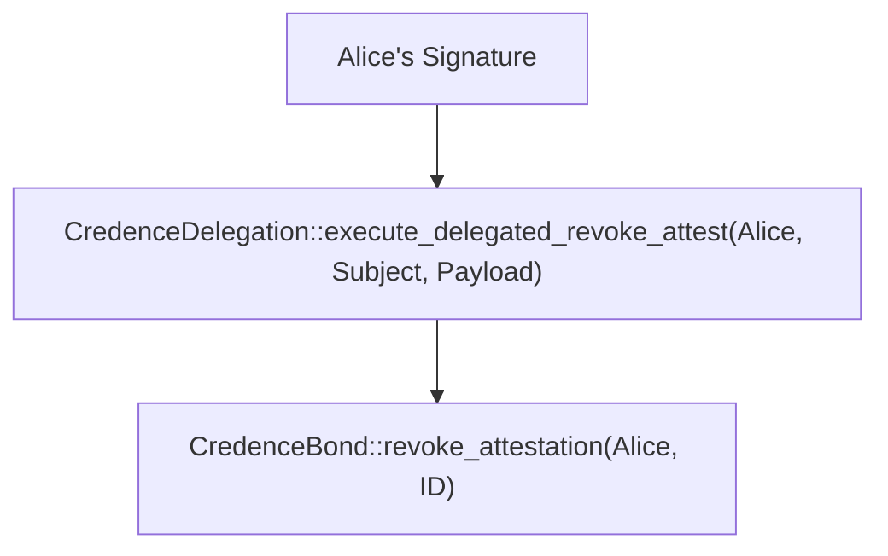

# Soroban Auth-Tree Threat Model

In Soroban, authorization is represented as a tree of `AuthorizeEntry` nodes. When a contract calls `require_auth(address)`, the host verifies that there is a valid branch in the current transaction's authorization tree that corresponds to the contract, the function being called, and the arguments provided.

Cross-contract interactions (like `CredenceDelegation` calling `CredenceBond`) produce nested trees. This document outlines the threats associated with these trees and how the Credence protocol mitigates them.

## Threat: Leaf Stripping

**Description**: An attacker intercepts a transaction and removes a leaf node from the authorization tree.
**Risk**: If a contract performs multiple auth-requiring actions but does not properly validate that all intended actions were authorized, an attacker might "strip" one action (e.g., stripping a fee payment while keeping the main action).
**Mitigation**: The Soroban host ensures that if a function calls `require_auth`, the tree MUST contain a matching entry. If the entry is missing, the transaction fails. We ensure every security-critical mutation in `CredenceBond` is guarded by `require_auth`.

## Threat: Root Hijacking / Wrapper Malleability

**Description**: An attacker wraps a legitimate authorized call inside a malicious contract call.
**Risk**: If Alice authorizes `ContractA` to call `ContractB`, an attacker might try to make `ContractC` call `ContractA`, hoping that `ContractA` doesn't check who its caller is.
**Mitigation**: `CredenceDelegation` uses `owner.require_auth()`. This ensures that Alice explicitly authorized the specific call to `CredenceDelegation`. In a cross-contract scenario, the tree shape is `Alice -> CredenceDelegation -> CredenceBond`. Alice's signature covers this entire path.

## Threat: Contract ID Malleability

**Description**: Alice authorizes a call to a contract, but an attacker replays that authorization against a different deployment of the same contract (e.g., on a different network or a different instance on the same network).
**Risk**: Unauthorized actions on different contract instances.
**Mitigation**: Soroban's `require_auth` automatically includes the `contract_id` and `network_id` in the signature hash. Additionally, `CredenceDelegation` payloads explicitly include the `contract_id` for domain separation.

## Threat: Argument Reordering / Substitution

**Description**: An attacker swaps the arguments of an authorized call.
**Risk**: Alice authorizes `slash(Bob, 100)`, but the attacker changes it to `slash(Alice, 100)`.
**Mitigation**: The `auth_tree` includes the function name and all arguments. Any variation in arguments will cause the signature verification to fail.

## Canonical Auth-Tree Shape for Credence

For a delegated action where a `Delegate` (Bob) performs a task on behalf of an `Owner` (Alice) using the `CredenceDelegation` contract to call `CredenceBond`:

The Soroban host verifies that `Alice` authorized the call to `CredenceDelegation`, and that `CredenceDelegation` is authorized to call `CredenceBond` on Alice's behalf.
